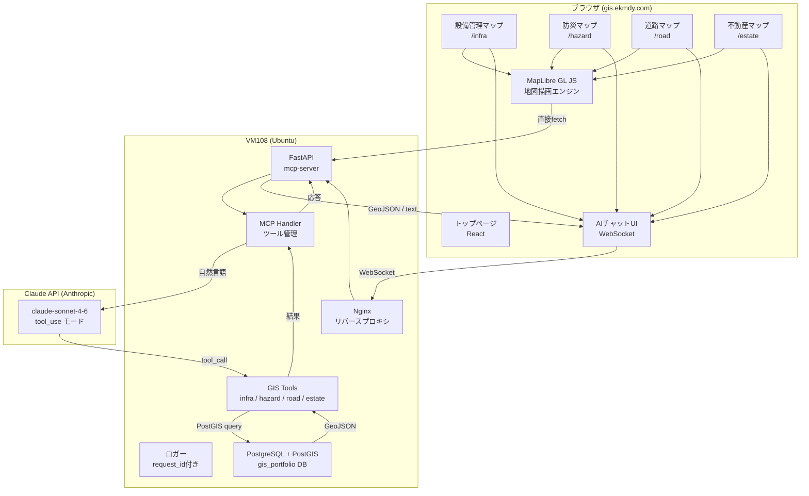

# システムアーキテクチャ

## 全体構成図



## AIの責任範囲とコードの責任範囲

```
┌─────────────────────────────────────────────────────────────┐
│  AIモデル（Claude）が担う範囲                                │
│  ・自然言語 → 呼び出すツール・パラメータの決定              │
│  ・複数ツールの組み合わせ判断                               │
│  ・ユーザーへの応答文章生成                                 │
├─────────────────────────────────────────────────────────────┤
│  コードが保証する範囲                                        │
│  ・PostGIS空間クエリの正確な実行                            │
│  ・座標・ジオメトリの妥当性検証（SRID・Bounding Box）       │
│  ・副作用操作（UPDATE/INSERT）の確認フロー・冪等性           │
│  ・ループ検知・タイムアウト・最大ツール呼び出し数制御        │
│  ・request_id付きロギング                                   │
│  ・AIダウン時のグレースフルデグレード                        │
└─────────────────────────────────────────────────────────────┘
```

## AI障害時のグレースフルデグレード（Q7対応）

```
通常時:
  ユーザー → AIチャット → MCPTools → PostGIS → 地図更新

AI障害時（Q7）:
  AIチャット → 503エラー表示 → "AI機能は一時利用不可です"
  地図表示・手動検索・属性パネル → 正常動作継続
  ※ MapLibreとPostGIS直接fetchは独立して動作
```

## セキュリティ設計

| 脅威 | 対策 |
|------|------|
| プロンプトインジェクション | ツール入力値をサーバー側でホワイトリスト検証 |
| 不正なジオメトリ | ST_IsValid()・Bounding Box制限 |
| 副作用の重複実行 | 冪等キー（idempotency_key）でDB側チェック |
| APIキー漏洩 | .envファイル・Nginx proxy経由でブラウザに非公開 |

## 技術選定理由

| 技術 | 選定理由 |
|------|---------|
| MapLibre GL JS | OSS・商用無料・GIS業界標準・Vector Tile対応 |
| React + Vite | モダンSPA・TypeScript対応・採用担当へのアピール |
| FastAPI | Python・非同期対応・OpenAPI自動生成・Claude SDK |
| PostGIS | 地理空間クエリのデファクトスタンダード |
| Claude API tool_use | MCPスタイルのAIエージェント実装 |
