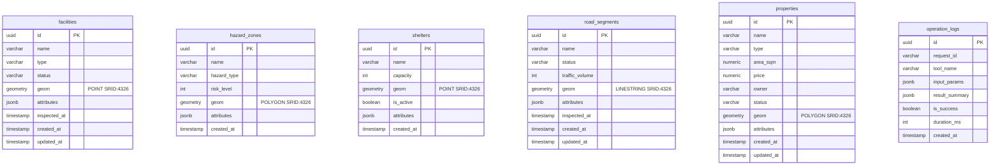

# ER図 / PostGISスキーマ

## ER図



## schema.sql（PostGIS）

```sql
-- schema.sql

CREATE EXTENSION IF NOT EXISTS postgis;
CREATE EXTENSION IF NOT EXISTS "uuid-ossp";

-- 設備管理
CREATE TABLE facilities (
    id          UUID PRIMARY KEY DEFAULT uuid_generate_v4(),
    name        VARCHAR(200) NOT NULL,
    type        VARCHAR(50) NOT NULL,   -- gas_pipe / electric_pole / valve / etc
    status      VARCHAR(20) NOT NULL DEFAULT 'normal',  -- normal / caution / repair
    geom        GEOMETRY(POINT, 4326) NOT NULL,
    attributes  JSONB DEFAULT '{}',
    inspected_at TIMESTAMPTZ,
    created_at  TIMESTAMPTZ DEFAULT NOW(),
    updated_at  TIMESTAMPTZ DEFAULT NOW()
);
CREATE INDEX idx_facilities_geom ON facilities USING GIST(geom);
CREATE INDEX idx_facilities_status ON facilities(status);

-- ハザードゾーン
CREATE TABLE hazard_zones (
    id          UUID PRIMARY KEY DEFAULT uuid_generate_v4(),
    name        VARCHAR(200),
    hazard_type VARCHAR(50) NOT NULL,  -- flood / landslide / tsunami
    risk_level  INT NOT NULL CHECK (risk_level BETWEEN 1 AND 5),
    geom        GEOMETRY(POLYGON, 4326) NOT NULL,
    attributes  JSONB DEFAULT '{}',
    created_at  TIMESTAMPTZ DEFAULT NOW()
);
CREATE INDEX idx_hazard_zones_geom ON hazard_zones USING GIST(geom);

-- 避難所
CREATE TABLE shelters (
    id          UUID PRIMARY KEY DEFAULT uuid_generate_v4(),
    name        VARCHAR(200) NOT NULL,
    capacity    INT,
    geom        GEOMETRY(POINT, 4326) NOT NULL,
    is_active   BOOLEAN DEFAULT TRUE,
    attributes  JSONB DEFAULT '{}',
    created_at  TIMESTAMPTZ DEFAULT NOW()
);
CREATE INDEX idx_shelters_geom ON shelters USING GIST(geom);

-- 道路区間
CREATE TABLE road_segments (
    id              UUID PRIMARY KEY DEFAULT uuid_generate_v4(),
    name            VARCHAR(200) NOT NULL,
    status          VARCHAR(20) NOT NULL DEFAULT 'normal',  -- normal / construction / closed
    traffic_volume  INT DEFAULT 0,
    geom            GEOMETRY(LINESTRING, 4326) NOT NULL,
    attributes      JSONB DEFAULT '{}',
    inspected_at    TIMESTAMPTZ,
    created_at      TIMESTAMPTZ DEFAULT NOW(),
    updated_at      TIMESTAMPTZ DEFAULT NOW()
);
CREATE INDEX idx_road_segments_geom ON road_segments USING GIST(geom);

-- 不動産物件（ポリゴン）
CREATE TABLE properties (
    id          UUID PRIMARY KEY DEFAULT uuid_generate_v4(),
    name        VARCHAR(200) NOT NULL,
    type        VARCHAR(50) NOT NULL,   -- residential / commercial / industrial / land
    area_sqm    NUMERIC(10,2),
    price       NUMERIC(15,0),
    owner       VARCHAR(200),
    status      VARCHAR(20) DEFAULT 'available',  -- available / sold / leased
    geom        GEOMETRY(POLYGON, 4326) NOT NULL,
    attributes  JSONB DEFAULT '{}',
    created_at  TIMESTAMPTZ DEFAULT NOW(),
    updated_at  TIMESTAMPTZ DEFAULT NOW()
);
CREATE INDEX idx_properties_geom ON properties USING GIST(geom);
CREATE INDEX idx_properties_type ON properties(type);

-- 操作ログ（Q8: 1回の失敗追跡）
CREATE TABLE operation_logs (
    id              UUID PRIMARY KEY DEFAULT uuid_generate_v4(),
    request_id      VARCHAR(36) NOT NULL,
    tool_name       VARCHAR(100),
    input_params    JSONB DEFAULT '{}',
    result_summary  JSONB DEFAULT '{}',
    is_success      BOOLEAN DEFAULT TRUE,
    duration_ms     INT,
    created_at      TIMESTAMPTZ DEFAULT NOW()
);
CREATE INDEX idx_operation_logs_request_id ON operation_logs(request_id);
CREATE INDEX idx_operation_logs_created_at ON operation_logs(created_at);
```
