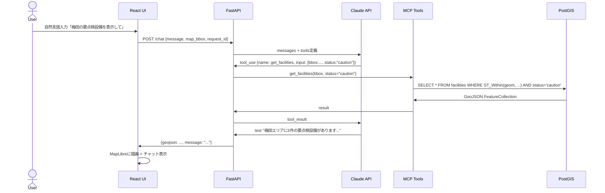

# AIエージェント設計・プロンプト設計

## エージェント全体フロー



## システムプロンプト

```
あなたはGIS地図システムのAIアシスタントです。
ユーザーの自然言語クエリを解釈し、適切なGISツールを呼び出して地図情報を取得・操作します。

## 重要なルール
1. 地図データの取得・検索は必ずツールを使うこと（知識から答えを作らない）
2. DBを変更する操作（update/register系）は必ずユーザーに確認を求めてからツールを呼ぶこと
3. 座標や範囲の指定が不明な場合は、現在の地図表示範囲（map_bbox）を使うこと
4. ツール呼び出しは最大10回まで。同じツールを3回連続で呼んだ場合は処理を停止すること
5. 回答は日本語で、簡潔に（3文以内）

## 現在の地図表示範囲
{map_bbox}

## アプリコンテキスト
{app_context}  # infra / hazard / road / estate
```

## コスト追跡設計（Q9対応）

```python
# claude_agent.py
async def run_agent(message: str, tools: list, request_id: str) -> AgentResult:
    token_tracker = TokenTracker(request_id=request_id)

    response = await claude_client.messages.create(
        model="claude-sonnet-4-6",
        tools=tools,
        messages=[{"role": "user", "content": message}],
    )

    # ツール別トークン消費を記録（Q9）
    token_tracker.record(
        tool_name=response.stop_reason,
        input_tokens=response.usage.input_tokens,
        output_tokens=response.usage.output_tokens,
        app_context=current_app,
    )
    return result
```

## AIで作った記録（採用担当向け説明文）

このポートフォリオは以下のAIツールを使って設計・実装しました：

- **Claude Code (claude-sonnet-4-6)**: 要件定義・設計ドキュメント・実装コードの生成
- **Claude API tool_use**: MCPスタイルのGISエージェント実装
- **AI活用の範囲**: コード生成・設計レビュー・テストケース生成
- **人間が担った範囲**: 要件定義・アーキテクチャ判断・データ設計・UI/UXレビュー・品質確認

開発ログの詳細は `06_dev-log.md` を参照。
